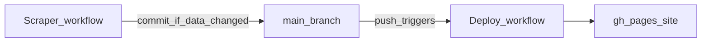

# MP University Results

Dashboard for **Madhya Pradesh university examination results** (and related links). The **React + Vite** frontend lives in [`website/`](website/); a **Python scraper** in [`scraper/`](scraper/) refreshes static JSON under `website/public/data/` for GitHub Pages.

## Repository layout

| Path | Purpose |
|------|---------|
| [`website/`](website/) | Vite + React app (`npm ci`, `npm run build` → `website/dist/`) |
| [`website/public/data/`](website/public/data/) | Category JSON consumed by the app (`results.json`, etc.) — updated by the scraper when validation passes |
| [`scraper/`](scraper/) | Fetch → normalize → dedupe → validate → `sync_to_website.py` |
| [`.github/workflows/deploy.yml`](.github/workflows/deploy.yml) | Build `website/` and publish to **`gh-pages`** (runs on pushes to `main` that touch `website/**` or this workflow) |
| [`.github/workflows/scrape.yml`](.github/workflows/scrape.yml) | Scraper: test → scrape → validate → sync → verify JSON → **production build** → commit data **only if changed** |
| [`scraper/scripts/ci_commit_website_data.sh`](scraper/scripts/ci_commit_website_data.sh) | Stages only `website/public/data/*.json`, prints diff, commits if needed |
| [`scraper/scripts/ci_validate_website_public_json.py`](scraper/scripts/ci_validate_website_public_json.py) | CI check: category JSON parses as arrays; `scrape_meta.json` is a small metadata object for the UI |

## End-to-end automation (scraper → live site)



1. **[`scrape.yml`](.github/workflows/scrape.yml)** runs on a **schedule** (default **every 5 minutes** UTC), **workflow_dispatch**, or **push to `main`** when `scraper/**` or this workflow changes.
2. **`main.py`** runs with **`SCRAPER_SKIP_WEBSITE_SYNC`** (writes under `scraper/output/` only).
3. **`validate_output.py --strict-run`** must pass, or the job stops (nothing is pushed).
4. **`sync_to_website.py`** copies only categories that are **valid and non-empty** (existing repo files are not overwritten with empty/invalid payloads), then copies **`scrape_meta.json`** (run id, scrape time, versions) so the live UI can show **when data last refreshed** without rebuilding the app.
5. **`ci_validate_website_public_json.py`** ensures category files parse as **JSON arrays** and **`scrape_meta.json`** parses as an object with required keys.
6. **`npm ci` and `npm run build`** in **`website/`** must succeed, or the job stops **before** any git commit — so broken data cannot reach `main` via this workflow.
7. **`ci_commit_website_data.sh`** stages **only** `website/public/data/*.json`. If there is no diff, it **does not commit**. If there is a diff, it commits with **`chore: update scraped website data`** and **pushes**.
8. That push changes **`website/**`**, which triggers **[`deploy.yml`](.github/workflows/deploy.yml)** (path filter). Deploy builds and publishes **`gh-pages`** via [peaceiris/actions-gh-pages](https://github.com/peaceiris/actions-gh-pages).

**Why a failed scraper run does not break the live site:** `main` and `gh-pages` are only updated after a **successful** push. Failed steps occur **before** `git push`, so the previous successful deploy stays live. Download the **`scraper-diagnostics-*`** artifact from the failed job for `run_summary.json` and logs.

### Operational checklist (exact clicks)

**Run a scrape now (manual)**  
1. GitHub repo → **Actions**.  
2. Left sidebar → **Scraper**.  
3. **Run workflow** → branch **`main`** → (optional) **export_csv** → **Run workflow**.  
4. Open the new run; expand collapsed **::group::** sections in the log for a readable trace.  
5. Green + commit step logs **`Committed and pushed updated website data.`** → **Deploy** should start on `main` shortly.  
6. Green + **`No changes to website/public/data/*.json — skipping commit`** → data matched repo already; **Deploy** does not run (no `website/` diff).

**Change how often the scraper runs**  
1. Edit [`.github/workflows/scrape.yml`](.github/workflows/scrape.yml).  
2. Change the `cron:` line under `schedule:` (GitHub uses **UTC**).  
3. Commit and push to `main`.

**Confirm the public URL**  
- Pattern: `https://<user>.github.io/<repo>/` (example: `https://ashishmvcuk.github.io/mp-aggregator/`).  
- In [`website/vite.config.js`](website/vite.config.js), **`repoName`** must equal the GitHub **repository name** (not the display name).

**Deploy when does it run?**  
- On push to **`main`** that changes files under **`website/**`** or **[`.github/workflows/deploy.yml`](.github/workflows/deploy.yml)**.  
- Pushes that only change **`scraper/`** or docs **outside `website/`** do **not** trigger Deploy (saves CI). Data updates always touch **`website/public/data/`**, so they still deploy.

**Recover from bad data (rare)**  
1. Revert the bad commit on `main` or restore `website/public/data/*.json` and push.  
2. **Deploy** will rebuild `gh-pages`.  
3. If bad data was committed despite checks, fix validation/parsers and re-run **Scraper**.

**Branch protection**  
If `github-actions[bot]` cannot push to `main`, enable **Allow GitHub Actions to create and approve pull requests** / workflows to push (repo **Settings** → **Actions** → **General**), or use a PAT secret (advanced).

## Frontend (website)

```bash
cd website
npm install
npm run dev
```

- **Production build:** `npm run build` → `website/dist/`
- **Preview:** `npm run preview`
- **Lint:** `npm run lint`

Open the URL shown in the terminal (usually `http://localhost:5173/`).

The app uses **HashRouter** for GitHub Pages: home is `…/mp-aggregator/#/`, admit cards `…/mp-aggregator/#/admit-cards`.  
Data: `website/src/services/resultsService.js` (`results.json`) plus `dashboardDataService.js` for `news.json`, `blogs.json`, `jobs.json`; admit cards page reads `admit_cards.json`.

**Deployed version badge:** [`website/package.json`](website/package.json) `version` is shown as **v…** (e.g. v1.1.0); [`scraper/VERSION`](scraper/VERSION) is shown as **Scraper v…**. **Deploy** injects `VITE_*` at build time. Bump `package.json` for site releases and `scraper/VERSION` when the scraper changes.

## Scraper

See [`scraper/README.md`](scraper/README.md) for architecture, categories, validation commands, and the optional **local scheduler** (`scheduler.py`).

Quick start:

```bash
cd scraper
python3 -m venv .venv && source .venv/bin/activate
pip install -r requirements.txt
python main.py
```

## GitHub Pages

**Pages setup:** Settings → Pages → deploy from branch **`gh-pages`**, folder **`/`**.

The **Deploy** workflow runs on pushes to **`main`** that change **`website/**`** or **[`.github/workflows/deploy.yml`](.github/workflows/deploy.yml)** — including automated **`chore: update scraped website data`** commits (they always touch `website/public/data/`).

---

© MP University Results — links point to official university sources; verify results on each institution’s portal.
