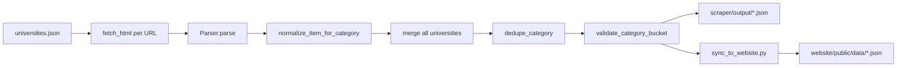

# Step 1: Current system (code-backed)

Evidence-based map of the MP Universities Aggregator: a static-site React dashboard fed by a Python HTML scraper, with GitHub Actions for scheduled refresh and optional Supabase for manual editorial rows. Findings below are grounded in repository code.

## Repository shape

| Area | Path | Role |
|------|------|------|
| Frontend | `website/` | Vite + React; builds to `website/dist/` |
| Scraper | `scraper/` | Python: fetch HTML → parse → normalize → dedupe → validate → JSON |
| Static data | `website/public/data/*.json` | Shipped with the app; updated by scraper sync + git |
| Workflows | `.github/workflows/scrape.yml`, `.github/workflows/deploy.yml` | CI: scrape → validate → sync → build → commit data; deploy to `gh-pages` |
| Optional DB schema | `docs/supabase-manual-entries.sql` | Supabase table `manual_entries` (not required for core app) |

There is **no first-party HTTP API** in this repo. The browser loads JSON from `public/data/` via `fetch()`. Optional **Supabase** is used only for **manual** rows (`website/src/lib/supabaseClient.js`, `website/src/services/manualEntriesService.js`).

## Features implemented (frontend)

**Routing** (`website/src/App.jsx`): `HashRouter` (GitHub Pages–friendly) with:

- `/` — `website/src/pages/HomePage.jsx`: results (ticker, summary cards, searchable list, chart), aggregated feeds (news last 30 days, jobs, admit cards preview, syllabus, blogs), sidebar enrollment preview + **university portal directory** (`universities.json`).
- `/admit-cards` — full admit-card list with search (`website/src/pages/AdmitCardsPage.jsx`).
- `/enrollments` — full enrollment/admission list with search (`website/src/pages/EnrollmentsPage.jsx`).
- `/admin` — content admin: **client-side gate** (optional `VITE_ADMIN_*` env or local dev; see `website/src/utils/adminGate.js`), then optional **Supabase Auth** to manage `manual_entries` (`website/src/pages/AdminPage.jsx`).

**Global**: `website/src/context/ScrapeMetaContext.jsx` + `website/src/components/VersionStamp.jsx` (build-time `VITE_*` versions from deploy workflow).

**Data merging**: Scraped JSON is merged with manual data via `website/src/utils/mergeFeedData.js` (manual rows first; dedupe by normalized URL). Manual sources: `website/public/data/manual_additions.json` and, if env vars are set, Supabase `manual_entries` (`website/src/services/manualEntriesService.js`).

## Data sources integrated (scraping)

**Configured sources** live in `scraper/config/universities.json`:

- **One row per institution** in [`scraper/config/universities.json`](../scraper/config/universities.json): `university`, `url` (primary page), optional **`seed_urls`** (extra pages merged into the same run), `parser` or **`parsers`** (list), `enabled`, and `group` (shown in the UI group filter when synced to `universities.json`).

**Production parser in use**: every enabled row uses **`"parser": "mp_portal"`**. The registry in `scraper/parsers/registry.py` also defines `rgpv`, `davv`, and `jiwaji`, but **those keys do not appear** in `scraper/config/universities.json`, so they are **unused in the live scrape config** (likely for tests or future per-site parsers).

**What is fetched**: one or more **HTTP GETs** per row (`url` plus any `seed_urls`), via `scraper/utils/fetcher.py` (`requests`, retries on transient errors). No APIs, RSS, or PDF text extraction—only HTML pages (PDFs appear as link targets).

**How HTML becomes records**: `scraper/parsers/mp_portal_parser.py` uses BeautifulSoup and shared helpers from `parsers/base_parser.py`: walks anchor candidates, classifies each link into one of seven categories using **keyword rules** on link text + URL path (first match wins). Caps **40 links per category per university**, dedupes by absolute URL, and filters some non-admission URLs for enrollments. Dates come from `extract_date_near_anchor` when available.

**Output categories** (fixed order in `scraper/utils/normalizer.py` `CATEGORY_ORDER`): `results`, `news`, `syllabus`, `admit_cards`, `enrollments`, `blogs`, `jobs` — each maps to a JSON file name (see `scraper/README.md`).

## Scraping / fetch pipeline (backend = Python batch job)

- **Entry**: `scraper/main.py` `run_once()`: loads config, loops enabled rows, fetch → parse → normalize into merged lists per category, then `_finalize_pipeline`: dedupe, validate, write `scraper/output/{category}.json`, history snapshots under `scraper/output/history/`, `run_summary.json`, `scrape_meta.json`.
- **Local vs CI website writes**: if `SCRAPER_SKIP_WEBSITE_SYNC` is truthy, `main.py` skips direct copy to `website/public/data/` during the run; **`.github/workflows/scrape.yml`** sets this for `main.py`, then runs **`scraper/sync_to_website.py`** separately after `validate_output.py --strict-run` so promotion is a distinct step.
- **`scraper/sync_to_website.py`**: reads each `scraper/output/{cat}.json`, re-validates; only copies categories that are **valid and non-empty** (invalid/empty skips leave existing site files unchanged). Also copies `scrape_meta.json` and **`sync_universities_directory_to_website`** in `scraper/utils/file_ops.py` (enabled `university` + `url` only → `website/public/data/universities.json`).

**Website field mapping for results**: canonical scraper records use `url`; `adapt_results_for_website` in `scraper/utils/file_ops.py` writes `result_url` for the React layer (`website/src/services/resultsService.js`).

## Storage, processing, display

| Layer | Mechanism |
|-------|-----------|
| **Persistence** | Git-tracked JSON under `website/public/`; scraper `output/` + `history/` for run artifacts. No SQLite/Postgres in-app. |
| **Processing** | Normalization (`scraper/utils/normalizer.py`), title refinement (`scraper/utils/title_refine.py`), dedupe (`scraper/utils/dedupe.py`), validation (`scraper/utils/validator.py` / `scraper/utils/output_validator.py`). |
| **Display** | React hooks load static JSON: e.g. `website/src/hooks/useResults.js` + `website/src/services/resultsService.js`; `website/src/hooks/useDashboardFeeds.js` + `website/src/services/dashboardDataService.js`. `website/public/data/scrape_meta.json` exposes `scrapedAt`, `runId`, counts, optional `ciRunId` (`write_scrape_meta` in `scraper/utils/file_ops.py`). |

## Workflows (automation)

1. **`.github/workflows/scrape.yml`** (schedule weekly UTC, `workflow_dispatch`, or push to `main` touching `scraper/**`): pytest → `python main.py` → `validate_output.py --strict-run` → `sync_to_website.py` → `ci_validate_website_public_json.py` → `npm ci && npm run build` (with Supabase secrets if present) → commit **only** `website/public/data/*.json` if changed → upload diagnostics artifact.
2. **`.github/workflows/deploy.yml`** (push to `main` changing `website/**` or the workflow): build with `VITE_APP_VERSION`, `VITE_SCRAPER_VERSION`, `VITE_BUILD_TIME`, optional Supabase env → **peaceiris/actions-gh-pages** to `gh-pages`.

## Summary table (strictly from code)

| Question | Answer |
|----------|--------|
| External data APIs | None in repo; only university **home page URLs** in config. |
| Scraping technology | `requests` + BeautifulSoup; keyword classification, not site-specific DOM scrapers in production (only `mp_portal`). |
| Alternate parsers | `rgpv`, `davv`, `jiwaji` registered but **not** used in `scraper/config/universities.json`. |
| Database | Optional Supabase for **manual** entries only; core data is static JSON. |

---

Next steps (optional): gaps such as wiring specialized parsers for specific universities, admit-card coverage, or hardening admin auth.
