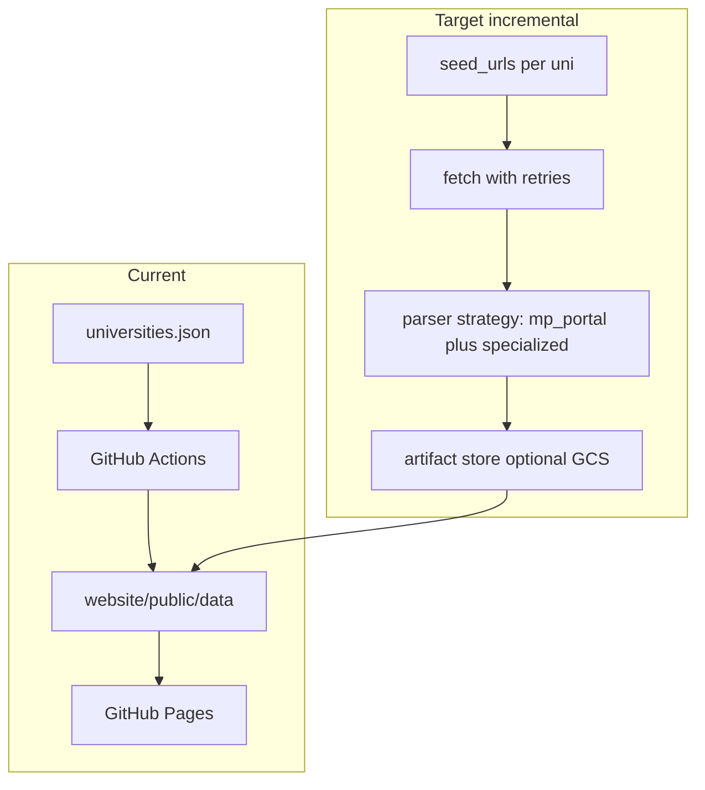

# MP Universities Aggregator: Research, Gaps, Backlog, Architecture

This document is the in-repo deliverable for Steps 2–5 (external research patterns, gap analysis, prioritized backlog, architecture). See also [`CURRENT_SYSTEM.md`](CURRENT_SYSTEM.md) for Step 1.

## Current system summary (code baseline)

- **Scope**: [40 enabled rows](../scraper/config/universities.json); production uses **`mp_portal`** only ([`PARSER_REGISTRY`](../scraper/parsers/registry.py)).
- **Fetch**: Single GET per university homepage ([`fetch_html`](../scraper/utils/fetcher.py)); **no retries**, **no JS execution**, **no PDF text extraction**.
- **Parse**: Keyword buckets on anchor text + URL ([`mp_portal_parser.py`](../scraper/parsers/mp_portal_parser.py)); cap **40 links/category/university**; merge → normalize → dedupe → validate → static JSON under [`website/public/data/`](../website/public/data/).
- **UI**: HashRouter app; search on results/admit/enrollments; feeds filtered by date windows in hooks (e.g. news last 30 days in [`useDashboardFeeds.js`](../website/src/hooks/useDashboardFeeds.js)); manual merge via [`mergeWithManual`](../website/src/utils/mergeFeedData.js) + optional Supabase.
- **Automation**: Weekly scrape ([`.github/workflows/scrape.yml`](../.github/workflows/scrape.yml)); deploy on `website/**` changes ([`deploy.yml`](../.github/workflows/deploy.yml)).

---

## Step 2: External research (ground truth) — patterns and verified samples

**Important limitation**: A full “visit every official site and map every subdomain” audit of **all 40** entries is not reproduced here line-by-line. Below combines **(A)** two **live fetches** (RGPV, DAVV), **(B)** public directory context ([Wikipedia list of MP higher-ed institutions](https://en.wikipedia.org/wiki/List_of_institutions_of_higher_education_in_Madhya_Pradesh)), and **(C)** known sector patterns for Indian university portals.

### Where content usually lives (typical patterns)

| Content type | Common locations | Format / barriers |
|--------------|------------------|-------------------|
| **Results** | Often **separate subdomain or vendor path** (e.g. `result.*.ac.in`, `crisp`/`egov` integrations), not only homepage carousel | **ASP.NET** forms, **captcha**, roll-number gates; sometimes only linked from “Examination” with **no keyword match** on home |
| **Admit cards** | Examination section, notice PDFs, sometimes dedicated exam portal | **PDF** announcements; dynamic **form** release |
| **Admissions** | “Admission”, “Prospectus”, **CUET**/state CET microsites | Mix of **HTML**, **PDF**, external **Google Forms** |
| **Syllabus / scheme** | Academics, PDF regulations | **PDF** heavy |
| **Notices / circulars** | “Latest news”, “Notices”, **PDF** lists | Very often **direct PDF hrefs** (good for link scrapers) |

### Verified samples (fetched in research session)

1. **[RGPV](https://www.rgpv.ac.in/)** (fetched homepage markdown): Content is **structure-heavy** (schools, UIT sections); **exam results** for large cohorts are widely known to live on **separate result hosts** (e.g. `result.rgpv.ac.in` / related domains — see public search results). **Implication**: Homepage-only scraping **under-captures** results unless homepage links prominently to those URLs with matching anchor keywords ([`MpPortalParser`](../scraper/parsers/mp_portal_parser.py) rules).
2. **[DAVV](https://www.dauniv.ac.in/)** (fetched): **Notices and circulars** are predominantly **`adminassets/pdf/...` links** with clear titles and dates. **Implication**: Link-based scraping can surface notices **well**; **tenders**, **scholarships**, and **mixed English/Hindi** titles stress **keyword classification** and **title refinement** quality.

### University-wise findings (40 in config) — practical matrix

For each row in [`universities.json`](../scraper/config/universities.json), treat as:

| Group (config) | Expected portal pattern | Research confidence |
|----------------|---------------------------|---------------------|
| `central` (IGNTU) | Central univ site; mixed notices | Medium — verify exam/result microsites |
| `state_government` | Classic CMS + PDF notices; some SPAs | High for “PDF notice lists”; Medium for results location |
| `state_specialized` (RGPV, MPMSU, NDVSU, music/arts) | **Specialized** exam/result stacks | **High risk** of homepage missing result deep links |
| `deemed` (IIITM, LNIPE) | Institute sites; IIIT-style academics | Medium |
| `private` (long tail) | Marketing-heavy homepages; **JS** sliders; variable CMS | **High variance** — some sites **JS-rendered** link lists |

**Per-university deep URLs** (exact “Results page URL” for all 40) should be captured in the team spreadsheet: [`university_source_urls.template.csv`](university_source_urls.template.csv) (columns `Primary_results_URL`, `Admit_URL`, etc. — fill manually).

### Frequency / format of updates (sector norms)

- **Exam results**: Bursts during result season; **not** aligned with weekly cron.
- **Notices**: Daily/weekly PDF posts on many state vars.
- **Admissions**: Seasonal (Apr–Aug); **CUET** and university CET pages update on their own cadence.

---

## Step 3: Gap analysis (implementation vs real world)

### Missing universities (vs broader MP landscape)

Cross-checking [Wikipedia’s MP university table](https://en.wikipedia.org/wiki/List_of_institutions_of_higher_education_in_Madhya_Pradesh) (incomplete/dated but useful) against the **40** in config — **examples of institutions not in** [`universities.json`](../scraper/config/universities.json):

- **State / specialized**: [Jawaharlal Nehru Krishi Vishwavidyalaya](https://en.wikipedia.org/wiki/Jawaharlal_Nehru_Agricultural_University) (Jabalpur); [Rajmata Vijayaraje Scindia Krishi Vishwavidyalaya](https://en.wikipedia.org/wiki/Rajmata_Vijayaraje_Scindia_Krishi_Vishwavidyalaya) (Gwalior); [Makhanlal Chaturvedi National University of Journalism and Communication](https://en.wikipedia.org/wiki/Makhanlal_Chaturvedi_National_University_of_Journalism_and_Communication) (Bhopal); [Mahatma Gandhi Chitrakoot Gramoday Vishwavidyalaya](https://en.wikipedia.org/wiki/Mahatma_Gandhi_Chitrakoot_Gramoday_University) (Chitrakoot); [Maharishi Panini Sanskrit Evam Vedic Vishwavidyalaya](https://en.wikipedia.org/wiki/Maharishi_Panini_Sanskrit_Evam_Vedic_Vishwavidyalaya) (Ujjain); [Sanchi University of Buddhist-Indic Studies](https://en.wikipedia.org/wiki/Sanchi_University_of_Buddhist-Indic_Studies); **Rani Awantibai Lodhi University, Sagar** (newer state entry on Wikipedia).
- **Private** (examples): [Shri Vaishnav Vidyapeeth Vishwavidyalaya](https://en.wikipedia.org/wiki/Shri_Vaishnav_Vidyapeeth_Vishwavidyalaya) (Indore); [G.H. Raisoni University](https://en.wikipedia.org/wiki/G.H._Raisoni_University) (Chhindwara); [SAM Global University](https://en.wikipedia.org/wiki/SAM_Global_University); [Sri Satya Sai University of Technology and Medical Sciences](https://en.wikipedia.org/wiki/Sri_Satya_Sai_University_of_Technology_%26_Medical_Sciences) (Sehore); others in the same table.
- **Autonomous / INI** (usually out of scope for a “state vars aggregator” but sometimes requested): NLIU Bhopal, IIT/IIM/IIIT/IISER/NIT/AIIMS — different information architecture entirely.

**Note**: DHSGSU appears in Wikipedia as **Central**; your config still lists `dhsgsu.ac.in` as state-group — **institutional reclassification** may need config/metadata correction (product decision, not scraped in code).

### Missing or weak categories

- **Tenders / procurement**: Often separate section (DAVV example); not a dedicated category in [`CATEGORY_ORDER`](../scraper/utils/normalizer.py).
- **Exam timetables / date sheets**: Sometimes distinct from “results” keywords.
- **Revaluation / photocopy / duplicate marksheet** (process PDFs): May classify as “results” noise or miss.
- **Circular-only** vs **news**: Keyword overlap causes **misclassification** (known limitation of single-pass keyword rules).

### Scraping limitations (technical)

- **JS-rendered menus**: `requests` + BeautifulSoup sees **empty or partial** link sets.
- **PDFs**: Captured as **links**, not **parsed content** (no title from inside PDF).
- **Subdomains / external exam portals**: If not linked from homepage with matching text, **invisible** to current pipeline.
- **Login / captcha**: Cannot automate ethically at scale in this architecture.
- **Weekly schedule** ([`scrape.yml` cron](../.github/workflows/scrape.yml)): Misaligned with **result-day** freshness expectations.

### Data freshness

- [`scrape_meta.json`](../website/public/data/scrape_meta.json) tracks `scrapedAt` and counts; **no per-university success SLA** in UI.
- Failed fetches drop entire university for that run ([`main.py`](../scraper/main.py)); **no partial degrade** beyond category-level skip in sync.

### UI/UX gaps

- Filters: **Group** (`central` / `state` / `private`) exists in config but **not exposed** in UI as filter (directory is flat sorted list).
- No **alert subscription** for new result rows.
- Search is **text** only; no **category** or **date range** controls on home (feeds use fixed windows in code).

### Reliability

- **Retries** are implemented in [`fetch_html`](../scraper/utils/fetcher.py) (transient failures); remaining risk is persistent upstream outages.
- **13 failures / 40** in sample [`scrape_meta.json`](../website/public/data/scrape_meta.json) from earlier analysis — operational risk.
- **No synthetic monitoring** of upstream HTTP status codes in production.

---

## Step 4: Prioritized backlog (table)

| Title | Description | Priority | Effort | Technical approach |
|-------|-------------|----------|--------|-------------------|
| **Per-source URL map + secondary fetches** | Maintain explicit `seed_urls[]` per university (home + examination + result subdomain). Fetch and merge before parse. | High | Medium | Extend [`universities.json`](../scraper/config/universities.json) schema; loop URLs in [`main.py`](../scraper/main.py); dedupe by link. |
| **Wire specialized parsers for high-traffic vars** | RGPV/DAVV already have classes in registry but unused — assign in config for result accuracy. | High | Medium | Set `"parser": "rgpv"` / `"davv"` etc. in config; implement/complete selectors in [`parsers/`](../scraper/parsers/). |
| **Retry + backoff for HTTP** | Reduce transient CI failures. | High | Small | Wrap [`fetch_html`](../scraper/utils/fetcher.py) with `urllib3` retry or tenacity; jitter; log status body snippet. |
| **Playwright (optional) fallback** | For JS-heavy homepages only — last resort. | Medium | Large | Separate job or flag; container cost; cache HTML; strict rate limits. |
| **PDF pipeline (lightweight)** | Extract title/date from notice PDFs when link text is generic. | Medium | Large | `pdfplumber` or cloud Vision only for top domains; store normalized title. |
| **Category taxonomy v2** | Split tenders, timetables, revaluation; reduce misclassification. | Medium | Medium | Extend `CATEGORY_ORDER` + UI tabs + migration of JSON + validator updates. |
| **Add missing state universities (curated)** | JNKVV, RVSKVV, Makhanlal Chaturvedi, etc. | Medium | Small–Medium | New rows in [`universities.json`](../scraper/config/universities.json); validate URLs manually. |
| **Notification service** | Email/Telegram on new rows since last hash. | Medium | Large | Post-build diff of `results.json` / `news.json`; serverless (Cloud Function) or GitHub Action artifact + subscriber list; **no creds in repo**. |
| **Search & filters v2** | Filter by university group, category, date range. | Medium | Medium | Client-side state + URL hash query params; optional pre-index JSON chunks. |
| **Scraper monitoring** | Alert when `universitiesFailed` > N or category empty unexpectedly. | High | Small | CI step posting to Slack/Telegram webhook; expose threshold in workflow env. |
| **Admin hardening** | Remove default gate creds; RLS-only Supabase. | Medium | Medium | Env-based allowlist; remove [`adminGate`](../website/src/utils/adminGate.js) defaults for prod. |
| **Increase scrape frequency (selective)** | Daily for exam season only. | Low | Small | Second workflow cron or `workflow_dispatch` template; cost-aware. |
| **Queue-based scraper (future)** | Decouple fetch from parse for scale. | Low | Large | Cloud Tasks / Pub-Sub; workers write to GCS; static export still builds site from artifacts. |

---

## Step 5: Architecture recommendations

- **Scalability**: Keep **static site + JSON** for cost; add **multi-URL** and **specialized parsers** before introducing workers. If volume grows, **queue** only the **fetch** stage; keep **normalize/validate** deterministic.
- **Cost (GCP or cloud)**: Prefer **GitHub-hosted** scrape + Pages; move to GCP only if Playwright fleet or PDF OCR needed — then use **preemptible** batch + **GCS** JSON artifacts + same deploy hook.
- **Reliability**: Retries, per-university **error budget** in summary, **alerting** on regression vs previous `run_summary.json`.
- **Extensibility**: Treat each university as **config + optional parser plugin**; document required fields in [`scraper/README.md`](../scraper/README.md).

---

## Companion artifact

**`docs/university_source_urls.template.csv`** — spreadsheet template (one row per configured university) for manual capture of primary results URL, admit URL, notices feed, auth/PDF notes, and last-checked date.

---

## Implementation status (repo)

| Backlog item | Status |
|--------------|--------|
| Retry + backoff for HTTP | Done ([`scraper/utils/fetcher.py`](../scraper/utils/fetcher.py)) |
| Per-source URL map (`seed_urls`) + merged parses | Done ([`scraper/main.py`](../scraper/main.py)) |
| Specialized parsers wired (RGPV + DAVV + `mp_portal`) | Done ([`scraper/config/universities.json`](../scraper/config/universities.json)) |
| Add JNKVV, RVSKVV, Makhanlal Chaturvedi | Done (same config file) |
| Scraper monitoring (failure budget) | Done ([`scraper/scripts/ci_scrape_healthcheck.py`](../scraper/scripts/ci_scrape_healthcheck.py), optional `vars` in [`scrape.yml`](../.github/workflows/scrape.yml)) |
| Webhook notification | Done ([`scraper/scripts/post_scrape_webhook.py`](../scraper/scripts/post_scrape_webhook.py), secret `SCRAPER_WEBHOOK_URL`) |
| Search & filters (university group) | Done (home dashboard + [`universities.json`](../website/public/data/universities.json) `group` field) |
| Admin hardening (env-based gate) | Done ([`website/src/utils/adminGate.js`](../website/src/utils/adminGate.js); production: set `VITE_ADMIN_*` secrets or Supabase only) |
| Increase scrape frequency | Done (weekday cron Mon–Fri 06:30 UTC in addition to weekly Sunday) |
| Playwright / PDF taxonomy / queue | Documented only: [`PLAYWRIGHT.md`](PLAYWRIGHT.md), [`PDF_PIPELINE.md`](PDF_PIPELINE.md), [`QUEUE_AND_SCALE.md`](QUEUE_AND_SCALE.md) |
