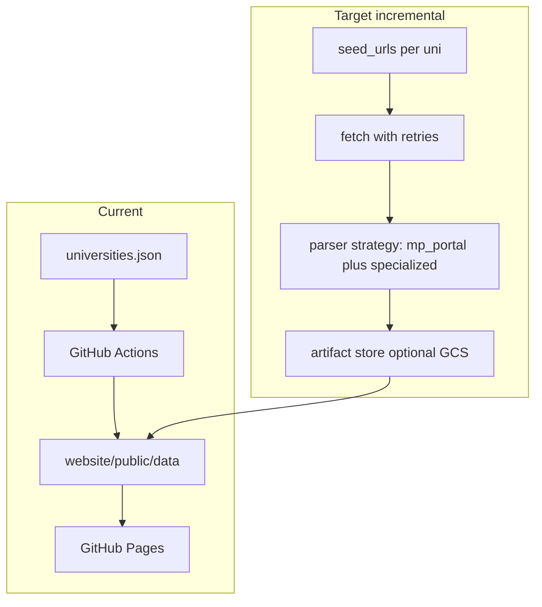

# MP Universities Aggregator: Research, Gaps, Backlog, Architecture

This document is the in-repo deliverable for Steps 2–5 (external research patterns, gap analysis, prioritized backlog, architecture). See also [`CURRENT_SYSTEM.md`](CURRENT_SYSTEM.md) for Step 1.

## Current system summary (code baseline)

- **Scope**: [40 enabled rows](../scraper/config/universities.json); production uses **`mp_portal`** only ([`PARSER_REGISTRY`](../scraper/parsers/registry.py)).
- **Fetch**: Single GET per university homepage ([`fetch_html`](../scraper/utils/fetcher.py)); **no retries**, **no JS execution**, **no PDF text extraction**.
- **Parse**: Keyword buckets on anchor text + URL ([`mp_portal_parser.py`](../scraper/parsers/mp_portal_parser.py)); cap **40 links/category/university**; merge → normalize → dedupe → validate → static JSON under [`website/public/data/`](../website/public/data/).
- **UI**: HashRouter app; search on results/admit/enrollments; feeds filtered by date windows in hooks (e.g. news last 30 days in [`useDashboardFeeds.js`](../website/src/hooks/useDashboardFeeds.js)); manual merge via [`mergeWithManual`](../website/src/utils/mergeFeedData.js) + optional Supabase.
- **Automation**: Weekly scrape ([`.github/workflows/scrape.yml`](../.github/workflows/scrape.yml)); deploy on `website/**` changes ([`deploy.yml`](../.github/workflows/deploy.yml)).

---

## Step 2: External research (ground truth) — patterns and verified samples

**Important limitation**: A full “visit every official site and map every subdomain” audit of **all 40** entries is not reproduced here line-by-line. Below combines **(A)** two **live fetches** (RGPV, DAVV), **(B)** public directory context ([Wikipedia list of MP higher-ed institutions](https://en.wikipedia.org/wiki/List_of_institutions_of_higher_education_in_Madhya_Pradesh)), and **(C)** known sector patterns for Indian university portals.

### Where content usually lives (typical patterns)

| Content type | Common locations | Format / barriers |
|--------------|------------------|-------------------|
| **Results** | Often **separate subdomain or vendor path** (e.g. `result.*.ac.in`, `crisp`/`egov` integrations), not only homepage carousel | **ASP.NET** forms, **captcha**, roll-number gates; sometimes only linked from “Examination” with **no keyword match** on home |
| **Admit cards** | Examination section, notice PDFs, sometimes dedicated exam portal | **PDF** announcements; dynamic **form** release |
| **Admissions** | “Admission”, “Prospectus”, **CUET**/state CET microsites | Mix of **HTML**, **PDF**, external **Google Forms** |
| **Syllabus / scheme** | Academics, PDF regulations | **PDF** heavy |
| **Notices / circulars** | “Latest news”, “Notices”, **PDF** lists | Very often **direct PDF hrefs** (good for link scrapers) |

### Verified samples (fetched in research session)

1. **[RGPV](https://www.rgpv.ac.in/)** (fetched homepage markdown): Content is **structure-heavy** (schools, UIT sections); **exam results** for large cohorts are widely known to live on **separate result hosts** (e.g. `result.rgpv.ac.in` / related domains — see public search results). **Implication**: Homepage-only scraping **under-captures** results unless homepage links prominently to those URLs with matching anchor keywords ([`MpPortalParser`](../scraper/parsers/mp_portal_parser.py) rules).
2. **[DAVV](https://www.dauniv.ac.in/)** (fetched): **Notices and circulars** are predominantly **`adminassets/pdf/...` links** with clear titles and dates. **Implication**: Link-based scraping can surface notices **well**; **tenders**, **scholarships**, and **mixed English/Hindi** titles stress **keyword classification** and **title refinement** quality.

### University-wise findings (40 in config) — practical matrix

For each row in [`universities.json`](../scraper/config/universities.json), treat as:

| Group (config) | Expected portal pattern | Research confidence |
|----------------|---------------------------|---------------------|
| `central` (IGNTU) | Central univ site; mixed notices | Medium — verify exam/result microsites |
| `state_government` | Classic CMS + PDF notices; some SPAs | High for “PDF notice lists”; Medium for results location |
| `state_specialized` (RGPV, MPMSU, NDVSU, music/arts) | **Specialized** exam/result stacks | **High risk** of homepage missing result deep links |
| `deemed` (IIITM, LNIPE) | Institute sites; IIIT-style academics | Medium |
| `private` (long tail) | Marketing-heavy homepages; **JS** sliders; variable CMS | **High variance** — some sites **JS-rendered** link lists |

**Per-university deep URLs** (exact “Results page URL” for all 40) should be captured in the team spreadsheet: [`university_source_urls.template.csv`](university_source_urls.template.csv) (columns `Primary_results_URL`, `Admit_URL`, etc. — fill manually).

### Frequency / format of updates (sector norms)

- **Exam results**: Bursts during result season; **not** aligned with weekly cron.
- **Notices**: Daily/weekly PDF posts on many state vars.
- **Admissions**: Seasonal (Apr–Aug); **CUET** and university CET pages update on their own cadence.

---

## Step 3: Gap analysis (implementation vs real world)

### Missing universities (vs broader MP landscape)

Cross-checking [Wikipedia’s MP university table](https://en.wikipedia.org/wiki/List_of_institutions_of_higher_education_in_Madhya_Pradesh) (incomplete/dated but useful) against the **40** in config — **examples of institutions not in** [`universities.json`](../scraper/config/universities.json):

- **State / specialized**: [Jawaharlal Nehru Krishi Vishwavidyalaya](https://en.wikipedia.org/wiki/Jawaharlal_Nehru_Agricultural_University) (Jabalpur); [Rajmata Vijayaraje Scindia Krishi Vishwavidyalaya](https://en.wikipedia.org/wiki/Rajmata_Vijayaraje_Scindia_Krishi_Vishwavidyalaya) (Gwalior); [Makhanlal Chaturvedi National University of Journalism and Communication](https://en.wikipedia.org/wiki/Makhanlal_Chaturvedi_National_University_of_Journalism_and_Communication) (Bhopal); [Mahatma Gandhi Chitrakoot Gramoday Vishwavidyalaya](https://en.wikipedia.org/wiki/Mahatma_Gandhi_Chitrakoot_Gramoday_University) (Chitrakoot); [Maharishi Panini Sanskrit Evam Vedic Vishwavidyalaya](https://en.wikipedia.org/wiki/Maharishi_Panini_Sanskrit_Evam_Vedic_Vishwavidyalaya) (Ujjain); [Sanchi University of Buddhist-Indic Studies](https://en.wikipedia.org/wiki/Sanchi_University_of_Buddhist-Indic_Studies); **Rani Awantibai Lodhi University, Sagar** (newer state entry on Wikipedia).
- **Private** (examples): [Shri Vaishnav Vidyapeeth Vishwavidyalaya](https://en.wikipedia.org/wiki/Shri_Vaishnav_Vidyapeeth_Vishwavidyalaya) (Indore); [G.H. Raisoni University](https://en.wikipedia.org/wiki/G.H._Raisoni_University) (Chhindwara); [SAM Global University](https://en.wikipedia.org/wiki/SAM_Global_University); [Sri Satya Sai University of Technology and Medical Sciences](https://en.wikipedia.org/wiki/Sri_Satya_Sai_University_of_Technology_%26_Medical_Sciences) (Sehore); others in the same table.
- **Autonomous / INI** (usually out of scope for a “state vars aggregator” but sometimes requested): NLIU Bhopal, IIT/IIM/IIIT/IISER/NIT/AIIMS — different information architecture entirely.

**Note**: DHSGSU appears in Wikipedia as **Central**; your config still lists `dhsgsu.ac.in` as state-group — **institutional reclassification** may need config/metadata correction (product decision, not scraped in code).

### Missing or weak categories

- **Tenders / procurement**: Often separate section (DAVV example); not a dedicated category in [`CATEGORY_ORDER`](../scraper/utils/normalizer.py).
- **Exam timetables / date sheets**: Sometimes distinct from “results” keywords.
- **Revaluation / photocopy / duplicate marksheet** (process PDFs): May classify as “results” noise or miss.
- **Circular-only** vs **news**: Keyword overlap causes **misclassification** (known limitation of single-pass keyword rules).

### Scraping limitations (technical)

- **JS-rendered menus**: `requests` + BeautifulSoup sees **empty or partial** link sets.
- **PDFs**: Captured as **links**, not **parsed content** (no title from inside PDF).
- **Subdomains / external exam portals**: If not linked from homepage with matching text, **invisible** to current pipeline.
- **Login / captcha**: Cannot automate ethically at scale in this architecture.
- **Weekly schedule** ([`scrape.yml` cron](../.github/workflows/scrape.yml)): Misaligned with **result-day** freshness expectations.

### Data freshness

- [`scrape_meta.json`](../website/public/data/scrape_meta.json) tracks `scrapedAt` and counts; **no per-university success SLA** in UI.
- Failed fetches drop entire university for that run ([`main.py`](../scraper/main.py)); **no partial degrade** beyond category-level skip in sync.

### UI/UX gaps

- Filters: **Group** (`central` / `state` / `private`) exists in config but **not exposed** in UI as filter (directory is flat sorted list).
- No **alert subscription** for new result rows.
- Search is **text** only; no **category** or **date range** controls on home (feeds use fixed windows in code).

### Reliability

- **Retries** are implemented in [`fetch_html`](../scraper/utils/fetcher.py) (transient failures); remaining risk is persistent upstream outages.
- **13 failures / 40** in sample [`scrape_meta.json`](../website/public/data/scrape_meta.json) from earlier analysis — operational risk.
- **No synthetic monitoring** of upstream HTTP status codes in production.

---

## Step 4: Prioritized backlog (table)

| Title | Description | Priority | Effort | Technical approach |
|-------|-------------|----------|--------|-------------------|
| **Per-source URL map + secondary fetches** | Maintain explicit `seed_urls[]` per university (home + examination + result subdomain). Fetch and merge before parse. | High | Medium | Extend [`universities.json`](../scraper/config/universities.json) schema; loop URLs in [`main.py`](../scraper/main.py); dedupe by link. |
| **Wire specialized parsers for high-traffic vars** | RGPV/DAVV already have classes in registry but unused — assign in config for result accuracy. | High | Medium | Set `"parser": "rgpv"` / `"davv"` etc. in config; implement/complete selectors in [`parsers/`](../scraper/parsers/). |
| **Retry + backoff for HTTP** | Reduce transient CI failures. | High | Small | Wrap [`fetch_html`](../scraper/utils/fetcher.py) with `urllib3` retry or tenacity; jitter; log status body snippet. |
| **Playwright (optional) fallback** | For JS-heavy homepages only — last resort. | Medium | Large | Separate job or flag; container cost; cache HTML; strict rate limits. |
| **PDF pipeline (lightweight)** | Extract title/date from notice PDFs when link text is generic. | Medium | Large | `pdfplumber` or cloud Vision only for top domains; store normalized title. |
| **Category taxonomy v2** | Split tenders, timetables, revaluation; reduce misclassification. | Medium | Medium | Extend `CATEGORY_ORDER` + UI tabs + migration of JSON + validator updates. |
| **Add missing state universities (curated)** | JNKVV, RVSKVV, Makhanlal Chaturvedi, etc. | Medium | Small–Medium | New rows in [`universities.json`](../scraper/config/universities.json); validate URLs manually. |
| **Notification service** | Email/Telegram on new rows since last hash. | Medium | Large | Post-build diff of `results.json` / `news.json`; serverless (Cloud Function) or GitHub Action artifact + subscriber list; **no creds in repo**. |
| **Telegram group alerts (phone + opt-in)** | Users who pick Telegram provide **phone**; join a **group** for scrape digests. | Medium | Medium–Large | Bot + group invite flow (see [Telegram alerts](#telegram-alerts--implementation-plan-group--phone)); Bot API token in secrets; **cannot auto-add by phone** — use invite link + optional `user_id` binding. |
| **Search & filters v2** | Filter by university group, category, date range. | Medium | Medium | Client-side state + URL hash query params; optional pre-index JSON chunks. |
| **Scraper monitoring** | Alert when `universitiesFailed` > N or category empty unexpectedly. | High | Small | CI step posting to Slack/Telegram webhook; expose threshold in workflow env. |
| **Admin hardening** | Remove default gate creds; RLS-only Supabase. | Medium | Medium | Env-based allowlist; remove [`adminGate`](../website/src/utils/adminGate.js) defaults for prod. |
| **Increase scrape frequency (selective)** | Daily for exam season only. | Low | Small | Second workflow cron or `workflow_dispatch` template; cost-aware. |
| **Queue-based scraper (future)** | Decouple fetch from parse for scale. | Low | Large | Cloud Tasks / Pub-Sub; workers write to GCS; static export still builds site from artifacts. |

---

## Step 5: Architecture recommendations

- **Scalability**: Keep **static site + JSON** for cost; add **multi-URL** and **specialized parsers** before introducing workers. If volume grows, **queue** only the **fetch** stage; keep **normalize/validate** deterministic.
- **Cost (GCP or cloud)**: Prefer **GitHub-hosted** scrape + Pages; move to GCP only if Playwright fleet or PDF OCR needed — then use **preemptible** batch + **GCS** JSON artifacts + same deploy hook.
- **Reliability**: Retries, per-university **error budget** in summary, **alerting** on regression vs previous `run_summary.json`.
- **Extensibility**: Treat each university as **config + optional parser plugin**; document required fields in [`scraper/README.md`](../scraper/README.md).

---

## Companion artifact

**`docs/university_source_urls.template.csv`** — spreadsheet template (one row per configured university) for manual capture of primary results URL, admit URL, notices feed, auth/PDF notes, and last-checked date.

---

## Implementation status (repo)

| Backlog item | Status |
|--------------|--------|
| Retry + backoff for HTTP | Done ([`scraper/utils/fetcher.py`](../scraper/utils/fetcher.py)) |
| Per-source URL map (`seed_urls`) + merged parses | Done ([`scraper/main.py`](../scraper/main.py)) |
| Specialized parsers wired (RGPV + DAVV + `mp_portal`) | Done ([`scraper/config/universities.json`](../scraper/config/universities.json)) |
| Add JNKVV, RVSKVV, Makhanlal Chaturvedi | Done (same config file) |
| Scraper monitoring (failure budget) | Done ([`scraper/scripts/ci_scrape_healthcheck.py`](../scraper/scripts/ci_scrape_healthcheck.py), optional `vars` in [`scrape.yml`](../.github/workflows/scrape.yml)) |
| Webhook notification | Done ([`scraper/scripts/post_scrape_webhook.py`](../scraper/scripts/post_scrape_webhook.py), secret `SCRAPER_WEBHOOK_URL`) |
| Search & filters (university group) | Done (home dashboard + [`universities.json`](../website/public/data/universities.json) `group` field) |
| Admin hardening (env-based gate) | Done ([`website/src/utils/adminGate.js`](../website/src/utils/adminGate.js); production: set `VITE_ADMIN_*` secrets or Supabase only) |
| Increase scrape frequency | Done (weekday cron Mon–Fri 06:30 UTC in addition to weekly Sunday) |
| Playwright / PDF taxonomy / queue | Documented only: [`PLAYWRIGHT.md`](PLAYWRIGHT.md), [`PDF_PIPELINE.md`](PDF_PIPELINE.md), [`QUEUE_AND_SCALE.md`](QUEUE_AND_SCALE.md) |
| User alerts (email / WhatsApp / RSS) | Not started — see [User alerts](#user-alerts-email--whatsapp--research-costing-backlog) below |
| Telegram alerts (group + phone opt-in) | Not started — see [Telegram alerts](#telegram-alerts--implementation-plan-group--phone) |

---

## User alerts (email / WhatsApp) — research, costing, backlog

**Goal:** Let visitors opt in to **notify on new notices** for chosen universities (and optionally channels), via **email** first, optional **Telegram** (low cost), **RSS** ($0), **WhatsApp** later if budget allows.

### No-cost / low-cost (recommended default)

**Target: ~$0/month** at modest scale by avoiding paid channels and staying inside free tiers.

| Approach | Why it fits | Cost |
| --- | --- | --- |
| **RSS / Atom per uni (or one global feed)** | Generate static feed(s) from existing JSON at deploy time; users subscribe in **free** reader apps (Feedly, Inoreader, OS readers). No accounts, no deliverability, no SMS/WhatsApp fees. | **$0** |
| **Email via provider free tier** | Resend, Brevo (Sendinblue), SendGrid, etc. often include **~3k emails/month** free; batch **weekly digest** to stay under cap. | **$0** while under cap |
| **Backend on free tier** | Supabase (or similar) **free** DB + auth for verified signups; or **serverless** free tiers + one secret store. | **$0** to start |
| **Send job in existing CI** | After scrape, a **GitHub Action** step (or webhook) sends only if diff non-empty — reuse minutes already used for scrape; keep jobs lightweight. | **$0** within Actions limits |
| **WhatsApp** | Per-conversation **paid**; BSPs add fees. Treat as **optional / later** unless you have budget or a sponsor. | Not low-cost at scale |
| **Telegram (bot + group/channel)** | [Bot API](https://core.telegram.org/bots/api) has **no per-message fee** for normal use; good for **group** digests or bot DMs. | **~$0** (API); ops time only |

**Practical MVP order:** (1) **RSS** if you only need “no infra” notifications → (2) **email** with free tier + digest → (3) **Telegram** group or bot for push without WhatsApp cost → (4) WhatsApp only if you must reach users who ignore email/Telegram.

### Research (short)

| Topic | Notes |
| --- | --- |
| **Email** | Transactional providers (Resend, SendGrid, Postmark, AWS SES, Mailgun). Double opt-in recommended for list quality and deliverability. Unsubscribe link required (CAN-SPAM / similar). |
| **WhatsApp** | [WhatsApp Business Platform](https://developers.facebook.com/docs/whatsapp) (Cloud API): **template messages** for outbound; pricing is **per 24h conversation** by category (utility / marketing / authentication / service). India rates change — use [Meta’s official pricing](https://developers.facebook.com/docs/whatsapp/pricing) before budgeting. BSPs (360dialog, Wati, etc.) add platform fees on top of Meta. |
| **Data & consent** | Store **hashed** tokens for verify/unsubscribe; minimal PII; clear privacy text; India **DPDP** awareness if scaling. |
| **Fit for this repo** | **Static site + JSON** stays; alerts need a **small backend** (e.g. Supabase or a tiny Cloud Function) for subscribe API, secrets, and send jobs — or a third-party “newsletter” product that accepts webhooks from CI. |

### Phased roadmap

1. **Phase A — Email digest or instant**  
   Signup form → verify email → store preferences (university IDs) → on each successful scrape (or daily digest job), diff `universities.json` / per-uni feeds → send only when new items match subscription.

2. **Phase B — Optional: WhatsApp** (not low-cost at volume)  
   Same preference model; register WhatsApp Business + templates; send via Cloud API or BSP; stricter template approval and conversation windows. **Defer** until email/RSS proves demand and you accept Meta + BSP cost.

3. **Phase C — Polish**  
   Frequency caps, quiet hours (IST), admin bounce handling, optional SMS fallback (usually skipped due to cost).

### Costing (order-of-magnitude; verify before launch)

**Default path:** Prefer **[No-cost / low-cost](#no-cost--low-cost-recommended-default)** above — RSS + digest email on free tiers keeps spend at **~$0** until you outgrow limits or add WhatsApp.

**Assumptions for examples (if you later exceed free tiers or add WhatsApp):**  
- **S** = small list (~**500** active subscribers).  
- **M** = medium (~**5 000**).  
- **One** notification email per subscriber per **week** on average (digest or “new notice” batched) → ~**2 000** emails/month (S) or ~**20 000** (M).  
- WhatsApp: assume **one utility (or marketing) conversation** per subscriber **per month** for alert delivery (actual model may batch into fewer conversations — this is conservative).

#### Email (Meta / industry ballpark — check each vendor’s current page)

| Tier | Approx. monthly send volume | Rough monthly cost |
| --- | --- | --- |
| **Free tiers** | Varies by provider (often ~100/day or ~3k/mo) | **$0** for pilots under cap |
| **AWS SES** (after free tier) | Often **~$0.10 per 1 000** emails (region-dependent) | **~$0.20** at 2k/mo; **~$2** at 20k/mo |
| **Resend / SendGrid / Postmark** | Bundled plans ($15–$25/mo for tens of thousands) | **~$0–25/mo** for S–M if within plan; scales with tier |

**Other email costs:** domain verification (SPF/DKIM) — **$0** if using existing domain; dedicated sending domain optional.

#### WhatsApp (India-oriented illustration — **verify on Meta’s pricing page**)

Meta bills **per conversation** (24-hour window), not per message. Published **India** figures in third-party summaries are often **~₹0.1–0.8 per conversation** depending on category (utility vs marketing); **service** conversations have a **free monthly allowance** (commonly cited **1 000** conversations/month — confirm).  

| Scenario | Conversations/mo (illustrative) | Order-of-magnitude Meta fee (India, verify) |
| --- | --- | --- |
| **S** — 500 subs, 1 utility alert convo each | 500 | **~₹55–200/mo** at ~₹0.11–0.40/utility convo (example range only) |
| **M** — 5 000 subs | 5 000 | **~₹550–2 000/mo** same illustrative range |

Add **BSP / tooling** ($0–$50+/mo) if not using raw Cloud API only.

#### Backend & jobs (if self-hosted)

| Item | Typical cost |
| --- | --- |
| **Supabase** (auth + DB + edge functions) | Free tier often enough to start; Pro **~$25/mo** when scaling |
| **GitHub Actions** (already used for scrape) | Within free minutes for light jobs; watch minutes if adding heavy workers |
| **Secrets / KMS** | Negligible at small scale |

**Bottom line:** **RSS + email on free tiers** can stay **~$0/mo** for a long time if you **batch digests** and cap list growth. **Telegram** is also **~$0** at the API layer. **WhatsApp** is the main cost lever — avoid it for a **no/low-cost** product unless budget exists.

---

## Telegram alerts — implementation plan (group + phone)

### Product intent

- User **opts in** to **Telegram** alerts (alongside or instead of email/RSS).
- User provides a **phone number** (and consent) as requested for your process.
- User ends up in a **Telegram group** where **scrape-based alerts** (digests) are posted.

### Telegram Bot API constraint (read before building)

The Bot API **does not** offer a supported flow to **programmatically add a user to a group using only a phone number** they typed on your website. Adding members typically requires:

- the user to **join via an invite link**, or  
- an **account with contact-level permissions** (not something a standard bot can do for arbitrary strangers), or  
- **manual** action by a group admin.

So the **implementation plan** below uses a **honest split**: **phone** is collected for **consent, verification, support, or optional future SMS OTP**; **group membership** is achieved by the user **opening Telegram and joining** with a link you issue. You can optionally **bind** their Telegram `user_id` to their account when they tap a **deep link** to your bot (`/start <token>`).

### Phased implementation plan

| Phase | What to build | Outcome |
| --- | --- | --- |
| **1 — Telegram assets** | Create a **Telegram group** (or **channel** if one-way broadcast is enough). Create a bot via [@BotFather](https://t.me/BotFather). Add the bot to the group as **admin** (post messages, invite users if you use generated links). Store `TELEGRAM_BOT_TOKEN` only in **secrets** (CI / backend), never in the repo. | Bot can post alerts; group exists for members. |
| **2 — Subscribe API + storage** | Extend the future subscriber model with something like: `telegram: { phone_e164, consent_at, join_token, telegram_user_id? }`. Validate phone format (e.g. E.164). Record **channel choice** = Telegram. | Backend can correlate signups with optional later binding. |
| **3 — Join flow (group + phone)** | After opt-in: show **instructions + invite link** to the group (`t.me/+…` or link created via [`createChatInviteLink`](https://core.telegram.org/bots/api#createchatinvitelink) if the bot is admin). **Optional:** link `https://t.me/<bot>?start=<signed_token>` so when the user starts the bot, you **store `from.id`** and mark “linked” — useful for support and future per-user features. **Copy:** explain that Telegram requires them to **join** the group; the phone number is for **your policy / verification**, not an automatic server-side add. | Users land in the group; you stay within platform rules. |
| **4 — Notify on new data** | After each successful scrape (or in CI), **diff** feeds vs previous artifact; if new items match policy, **post one digest message** to the group via `sendMessage` (bot must remain in group). Respect [rate limits](https://core.telegram.org/bots/faq#my-bot-is-hitting-limits-how-do-i-avoid-this); keep messages short; link back to the site for detail. | Subscribers see updates in Telegram **~$0** API cost. |
| **5 — Privacy & retention** | Privacy text: why phone is collected, retention, deletion path. Minimize stored fields; encrypt at rest if available. | DPDP-sensible baseline. |

### Alternative if “group + same message for everyone” is too noisy

- **Bot DMs:** user `/start` with payload → you store `chat_id` → send **personalized** digests per subscription. Phone on the website becomes optional. Still **~$0** API cost; different UX than a shared group.

### Backlog (Telegram — group + phone)

- [ ] Create Telegram **group** (or channel) + **bot**; bot **admin**; document moderation / spam rules.
- [ ] Store **bot token** in secrets; never commit; rotate if leaked.
- [ ] **Subscribe UX:** opt-in for Telegram + **phone** field + consent copy explaining **join via link** (and what phone is used for).
- [ ] **Join flow:** issue **invite link** (static or programmatic); optional **deep link** to bot to capture `telegram_user_id` and link to row.
- [ ] **Post job:** after scrape, diff → `sendMessage` to group (digest); handle failures and retries.
- [ ] **Optional:** admin view or export of pending signups (phone + status) for **manual** help — only if needed; avoid storing unnecessary PII.
- [ ] **Do not** promise fully automated “we add your phone into the group” unless you implement a **verified** flow that complies with Telegram’s rules (default is **invite link + user action**).

### Backlog (alerts)

- [ ] Choose channel priority: **RSS and/or email first** (low cost); **Telegram** for push without WhatsApp cost; **WhatsApp last** unless funded.
- [ ] **RSS/Atom** from published JSON (or per-university feeds) for **$0** user-side alerts via feed readers.
- [ ] Legal/privacy: consent copy, unsubscribe, data retention for India context; **Telegram + phone** called out explicitly.
- [ ] Design subscribe UX (per university, frequency, channels — **including Telegram branch**).
- [ ] Backend: verified email storage, preference schema, secure unsubscribe tokens; **Telegram/phone fields** as above.
- [ ] Job: diff new notices after scrape → queue sends (rate-limited); **Telegram group post** as one channel.
- [ ] Email: SPF/DKIM, provider account, bounce handling.
- [ ] WhatsApp: Business Manager, templates, BSP vs direct Cloud API decision.
- [ ] Cost monitoring: cap sends per run, digest vs instant tradeoff.
