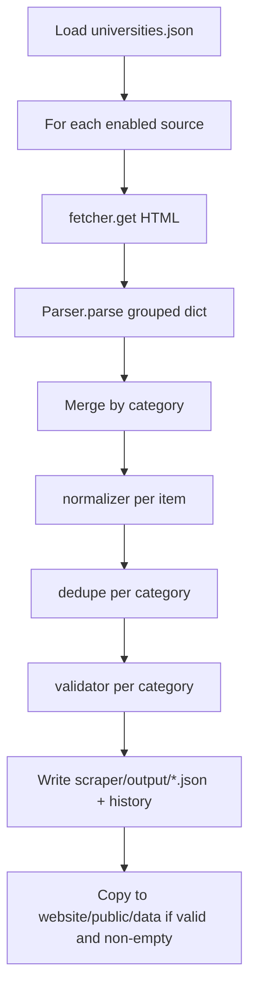

# MP Aggregator scraper

Python pipeline that fetches configured university portals, parses HTML into normalized records, validates them, writes JSON under `scraper/output/`, and **conditionally** syncs files into `website/public/data/` for the static React app.

## Architecture



Each run also writes **`output/scrape_meta.json`** (timestamps, run id, versions). **`sync_to_website.py`** copies it to **`website/public/data/scrape_meta.json`** so the deployed UI can show when data last refreshed without a new frontend build.

## Categories

Allowed category keys (every parser returns all six; empty lists are fine):

| Category       | Output file              |
|----------------|--------------------------|
| `results`      | `results.json`           |
| `news`         | `news.json`              |
| `syllabus`     | `syllabus.json`          |
| `admit_cards`  | `admit_cards.json`       |
| `blogs`        | `blogs.json`             |
| `jobs`         | `jobs.json`              |

## Data shape

**Canonical record** (internal and `scraper/output/<category>.json` except website-facing results):

```json
{
  "university": "RGPV",
  "title": "…",
  "url": "https://…",
  "date": "2026-04-05",
  "category": "results"
}
```

**Website `results.json`** uses `result_url` instead of `url` (same value) so the existing React service keeps working. Other categories copied to the site keep the canonical `url` field until the UI consumes them.

Rows whose titles start with **`[MOCK]`** are deterministic placeholders when a parser cannot find matching links yet; replace them with real selectors in the parser modules.

**Titles in the UI:** During normalization, [`utils/title_refine.py`](utils/title_refine.py) shortens noisy anchor text (table rows, “click here…”, long boilerplate) into a headline-style `title` per category. [`parsers/base_parser.py`](parsers/base_parser.py) `iter_anchor_candidates` prefers the HTML `title` attribute when visible link text is very long.

## Configuration

Edit [`config/universities.json`](config/universities.json): array of objects with:

| Field | Required | Meaning |
|-------|----------|---------|
| `university` | yes | Display name |
| `url` | yes | Portal URL to fetch |
| `parser` | yes | Registry key — `mp_portal` (default for MP sites), or `rgpv` / `davv` / `jiwaji` (see [`parsers/`](parsers/)) |
| `enabled` | no (default `true`) | `false` skips the source |
| `group` | no | Metadata only (`central`, `state_government`, `state_specialized`, `deemed`, `private`) — ignored by the runner |

The file includes a broad **Madhya Pradesh inventory** (central, state, specialized, deemed, and major private universities). Only sources with a **tested parser** should stay **`enabled: true`** today (RGPV, DAVV, Jiwaji). For others, set **`enabled: true`** only after you add a dedicated parser or confirm the generic **`rgpv`** link harvester does not emit unwanted **`[MOCK]`** rows on that site.

## Run

From the **`scraper/`** directory (so imports resolve):

```bash
python3 -m venv .venv
source .venv/bin/activate   # Windows: .venv\Scripts\activate
pip install -r requirements.txt
python main.py
```

Continuous polling (default **300** seconds between runs):

```bash
python scheduler.py
```

Override the interval (values below **30** are clamped to 30 to avoid accidental tight loops):

```bash
export SCRAPER_INTERVAL_SECONDS=600
python scheduler.py
```

Settings live in [`scheduler_config.py`](scheduler_config.py); the scheduler logs the effective interval and whether it came from the environment or the default.

Logs: console plus rotating `scraper/logs/scraper.log`. Use **DEBUG** on the `utils.normalizer` / `utils.dedupe` loggers to see per-item drops and dedupe skips.

## Outputs

| Path | Purpose |
|------|---------|
| `scraper/output/<category>.json` | Latest validated items per category (may be empty arrays). |
| `scraper/output/history/<UTC>_<category>.json` | Per-run snapshot. |
| `scraper/output/run_summary.json` | Per-run rollup: `run_id`, `run_timestamp`, university counts, `raw_counts` (items parsed into each bucket before normalization), `unique_counts` (after dedupe), `categories` (per-category pipeline stats), `copy_status`, `failures`. |

### `run_summary.json` — `categories` fields

Each category key includes:

- `parsed_from_sources` — rows emitted by parsers into that bucket
- `normalized_kept` / `normalized_dropped` — kept vs dropped by the normalizer
- `after_dedupe` / `dedupe_removed` — list size after dedupe and how many were skipped as duplicates
- `validation_error_count` / `valid_for_output` — validator results
- `copy_status` / `copy_reason` — website sync outcome
- `website_relative_path` — e.g. `public/data/results.json`
| `website/public/data/<category>.json` | Synced only when that category’s list is **valid and non-empty**; otherwise the previous file is left unchanged. |

Generated `scraper/output/` JSON and `scraper/logs/*.log` are listed in the repo root `.gitignore`.

## Website sync rules

1. Validate required fields: `university`, `title`, `url`, `date`, `category`, and category in the allowlist; plus light semantic checks (ISO date string, `http`/`https` URL).
2. If validation errors exist **or** the valid list is **empty** → **do not** copy to `website/public/data/` (preserves existing site data).
3. **Safe write:** JSON is serialized and round-trip parsed in memory, written to a temp file in the same directory, read back once, then atomically replaced — so a bad payload should not clobber an existing good file.

## Deduplication

Implemented in [`utils/dedupe.py`](utils/dedupe.py):

- **`results`**, **`syllabus`**, **`admit_cards`**: same URL after stripping common tracking query params (`utm_*`, `fbclid`, `gclid`, etc.) counts as one row (first wins).
- **`news`**, **`blogs`**: key is normalized title plus URL host (URLs are often unstable on these pages).

## Add a parser

1. Subclass [`parsers/base_parser.py`](parsers/base_parser.py) and implement `parse(html, university, source_url) -> dict[str, list[dict]]`. Reuse helpers such as `raw_item`, `iter_anchor_candidates`, and `empty_categories` where possible.
2. Register the class in [`parsers/registry.py`](parsers/registry.py) `PARSER_REGISTRY`.
3. Re-export from [`parsers/__init__.py`](parsers/__init__.py) if you want a stable package import.
4. Add a row to `config/universities.json` with the matching `parser` key.

## Add a category

1. Add the name to `CATEGORY_ORDER` / `ALLOWED_CATEGORIES` in [`utils/normalizer.py`](utils/normalizer.py).
2. Extend `empty_categories()` / base parser contract so every parser returns the new key (empty list allowed).
3. Adjust dedupe strategy in [`utils/dedupe.py`](utils/dedupe.py) if the new category needs URL- vs title-based keys.
4. Update [`utils/validator.py`](utils/validator.py) if field rules differ.

## Customize behavior

- **URLs and enable flags:** `config/universities.json`
- **Selectors and heuristics:** `parsers/*_parser.py`
- **Date formats / locale:** `utils/normalizer.py`
- **SSL / flaky sites:** failures are logged per source; the run continues. For strict certificate issues on some hosts you may need OS trust store updates or a custom session (not enabled by default).

## CI

- **Site:** [`.github/workflows/deploy.yml`](../.github/workflows/deploy.yml) builds `website/` and publishes to `gh-pages` on every push to **`main`** (including `chore: update scraped website data` from the scraper).
- **Scraper:** [`.github/workflows/scrape.yml`](../.github/workflows/scrape.yml) runs pytest → scrape → validate → `sync_to_website.py` → [`ci_validate_website_public_json.py`](scripts/ci_validate_website_public_json.py) → **production `npm run build`** → commits only `website/public/data/*.json` if changed ([`scripts/ci_commit_website_data.sh`](scripts/ci_commit_website_data.sh)). A failed step does **not** push; the live site is unchanged.

## Optional future work

- **Playwright** (or similar) for JavaScript-heavy portals — not part of the default path today.

## Testing and validation

**Why JSON first:** The site and tooling consume structured records with typed fields. JSON round-trips through `json.loads` checks in website writes and keeps one canonical shape per category under `scraper/output/`. CSV is a **derived** view for spreadsheets only.

**Commands** (from `scraper/`):

| Command | Purpose |
|---------|---------|
| `python main.py` | Live fetch, normalize, dedupe, validate; writes `output/*.json` and optionally syncs to `website/public/data/` |
| `python validate_output.py` | Validate existing `output/<category>.json` (required fields, URLs, dates, no duplicate dedupe-keys) |
| `python validate_output.py --strict-run` | Also fail if `run_summary.json` shows `universities_success >= 1` but `all_categories_empty` |
| `python export_csv.py` | Write `output/csv/<category>.csv` from JSON (`date_time` = noon UTC for the row `date`; `exported_at` = UTC timestamp when the CSV was generated) |
| `python sync_to_website.py` | Copy **only** categories that pass validation and are non-empty into `website/public/data/` |
| `python run_scraper_validate.py` | Run `main.py` then `validate_output.py` (use `--skip-website` to set `SCRAPER_SKIP_WEBSITE_SYNC=1` on the scraper step) |
| `python run_fixtures.py --validate` | Offline run using `tests/fixtures/` HTML + `fixtures_universities.json`, then validate |

**Environment:**

- `SCRAPER_SKIP_WEBSITE_SYNC=1` — `main.py` / `run_fixtures` write `scraper/output/` but do **not** update `website/public/data/` (useful in CI before `sync_to_website.py`).

**Pytest:** `pip install -r requirements-dev.txt` then `python -m pytest tests/ -q`.

## GitHub Actions

Workflow: [`.github/workflows/scrape.yml`](../.github/workflows/scrape.yml).

- **Triggers:** `schedule` (cron, default **every 5 minutes** UTC), `workflow_dispatch` (optional **export_csv**), and `push` to **`main`** when `scraper/**` or this workflow file changes.
- **Scraper version (UI):** bump [`VERSION`](VERSION) when the scraper pipeline meaningfully changes; the **Deploy** workflow passes it into the site build as **Scraper v…** in the corner.
- **Steps:** install deps → pytest → `main.py` → `validate_output.py --strict-run` → `sync_to_website.py` → validate public JSON → **`npm ci` / `npm run build` in `website/`** (blocks a bad commit) → optional CSV → commit/push only changed `*.json` → artifact **`scraper-diagnostics-<run_id>`** (`if: always()`).

A push to `main` that changes **`website/**`** (including data commits) triggers **Deploy** (path-filtered); see root [README.md](../README.md).
